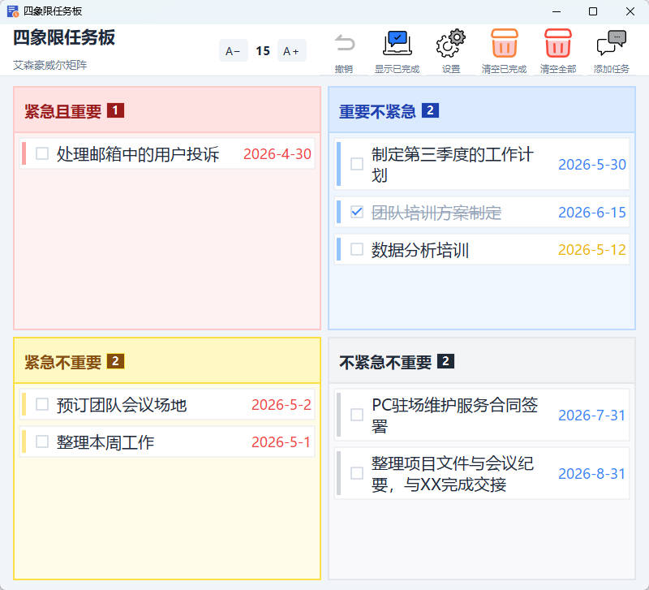

# 四象限任务板 (Quadrant Task Board)

基于 PySide6 的艾森豪威尔矩阵（Eisenhower Matrix）任务管理桌面应用。



## 功能特性

### 四象限管理
- **紧急且重要 (Q1)** - 立即处理，红色系
- **重要不紧急 (Q2)** - 规划执行，蓝色系
- **紧急不重要 (Q3)** - 委托他人，黄色系
- **不紧急不重要 (Q4)** - 考虑删减，灰色系

### 核心功能
- **拖拽移动** - 任务卡片可在象限间自由拖拽
- **双击编辑** - 双击任务卡片直接编辑，无需通过按钮
- **截止日期** - 支持 YYYY-MM-DD 格式，颜色随临近程度变化
- **完成标记** - 点击复选框标记任务完成，支持显示/隐藏已完成任务
- **字号调节** - 工具栏 A− / A＋ 按钮调节全局字体大小
- **颜色自定义** - 设置界面可自定义各状态截止日期颜色
- **数据持久化** - 自动保存到 `quadrant_data.json`
- **双击添加** - 双击象限空白区域，快速添加任务到该象限

### 工具栏按钮
- `＋ 添加任务` - 新建任务
- `显示已完成` - 复选框控制已完成任务显示
- `设置` - 自定义截止日期颜色与阈值
- `清空已完成` - 一键清除当前象限已标记任务
- `清空全部` - 清除当前象限所有任务（需确认）

## 界面预览

应用采用现代 Fusion 风格，中文雅黑字体，四象限以不同色调区分：
- Q1 红色调、Q2 蓝色调、Q3 黄色调、Q4 灰调
- 任务卡片左侧带有象限色条标识
- 鼠标悬停显示删除动作条（位于右下角，与截止日期重叠）

### 添加/编辑对话框
- 象限以 2x2 可视化网格展示，带象限色条
- 选中象限高亮显示，操作更直观

## 技术栈

- **Python 3.11+**
- **PySide6** - Qt 图形界面
- **PyInstaller** - 打包为独立 EXE

## 项目结构

```
QuadrantTask/
├── main.py              # 应用入口
├── __init__.py          # 包初始化，版本信息
├── constants.py         # 全局常量：象限定义、颜色、字体
├── data.py              # 数据持久化层（JSON）
├── main_window.py       # 主窗口与工具栏
├── quadrant_panel.py    # 单个象限面板（含拖放逻辑）
├── task_card.py         # 可拖拽任务卡片组件
├── dialogs.py           # 添加/编辑/设置对话框
├── icon.svg             # 窗口图标
├── QuadrantTask.spec    # PyInstaller 打包配置
├── quadrant_data.json   # 任务数据存储
└── Preview.jpg          # 预览图
```

## 运行方式

### 直接运行源码
```bash
pip install PySide6
python main.py
```

### 打包为 EXE
```bash
pip install pyinstaller
pyinstaller QuadrantTask.spec
```
生成的可执行文件位于 `dist/QuadrantTask.exe`。

## 数据存储

运行时数据保存在：
- **开发模式**: `QuadrantTask/quadrant_data.json`
- **打包后**: `QuadrantTask.exe` 同目录下的 `quadrant_data.json`

包含字段：`font_size`、`geometry`（窗口位置）、`deadline_colors`、`deadline_thresholds`、`tasks`（各象限任务列表）。

## 版本

v1.1.0
