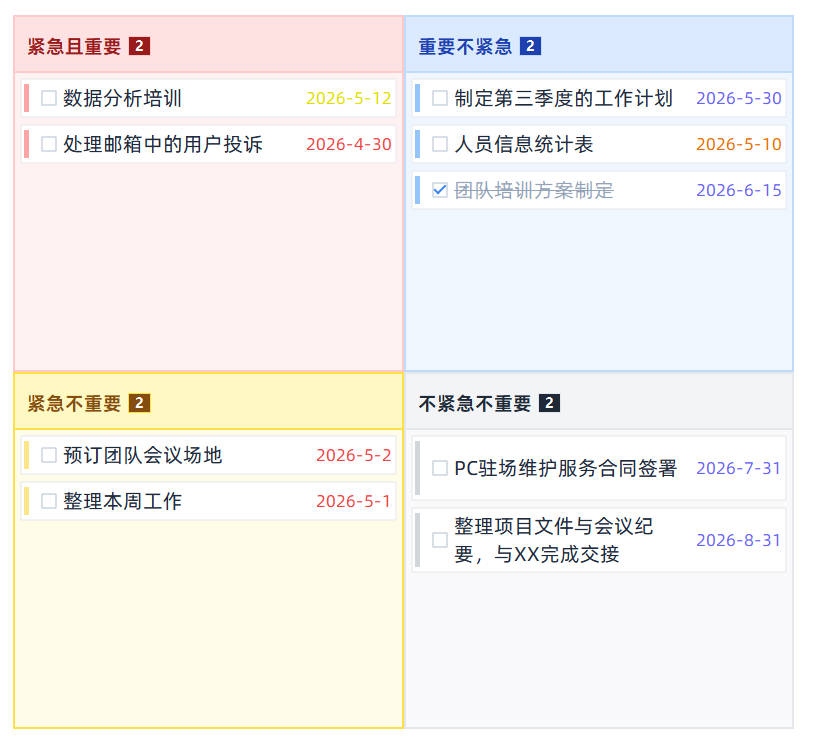

# 四象限任务板

基于 PySide6 的四象限时间管理工具，将任务按照重要性和紧急性分为四个象限进行管理。




## 功能特性

- **四象限管理**：将任务按重要/紧急程度分配到四个象限
- **拖拽排序**：任务卡片支持拖拽调整顺序
- **撤销/重做**：支持多步撤销和重做操作
- **截止日期**：支持为任务设置截止日期，自动以颜色标识剩余时间
- **显示/隐藏已完成**：可切换已完成任务是否显示
- **字体调节**：支持调节界面字体大小
- **HiDPI 支持**：完美适配各种分辨率屏幕

## 运行

```bash
pip install -r requirements.txt
python main.py
```

## 数据存储

运行时数据保存在 `quadrant_data.json`，包含字段：
- `font_size` - 全局字体大小
- `geometry` - 窗口位置与尺寸
- `deadline_colors` - 截止日期颜色配置
- `deadline_thresholds` - 截止日期颜色阈值
- `tasks` - 各象限任务列表

## 版本

v1.2.2

### v1.2.2 设置界面优化

#### 设置界面重构
- 标题栏与主体区域无缝衔接，主体区域外圈添加 1px 黑色边框
- 去除主体区域内部元素的独立边框
- 日期 spinbox 改为纯数字输入框
- 截止日期配置区域结构重组为 6 行：已过期、即将到期、近期、中期、远期、无日期
- 日期阈值键名重命名（`urgent`/`short_term`/`medium_term`/`long_term`）更清晰

#### 字体设置预览
- 设置界面添加字体大小调节按钮（与主界面同步）
- 实时预览字体变化效果
- 取消时自动恢复原始设置

#### 架构改进
- 设置对话框支持 `font_size` 和 `on_font_size_change` 回调参数
- `SettingsDialog` 初始化时从外部传入 `font_size`，保持与主界面字体一致

### v1.2.1 HiDPI 图标修复

- 改用环境变量 `QT_ENABLE_HIGHDPI_SCALING` 和 `QT_SCALE_FACTOR_ROUNDING_POLICY` 启用 HiDPI 支持，替代已弃用的 `AA_EnableHighDpiScaling` 属性
- 图标始终添加 1x 和 2x 两个分辨率版本，Qt 根据当前 DPI 自动选择最合适的版本
- 修复切换图标时只显示左上四分之一的问题
- 支持所有 DPI 缩放比例：100%、125%、150%、175%、200%、225% 等

### v1.2.0 更新内容

#### 代码重构
- **类型提示**：全项目添加 Python Type Hinting，提升 IDE 支持
- **命名规范**：遵循 PEP 8，变量/函数名更具语义
- **撤销系统解耦**：QuadrantPanel 通过公开接口（`push_undo`/`find_task`）操作撤销，消除直接访问内部属性
- **信号槽优化**：所有槽函数添加 `@Slot()` 装饰器，提升性能
- **if/elif 修复**：修复 `_update_widget_fonts` 中的逻辑 bug

#### DPI 自适应
- 所有硬编码像素值改为 DPI 自适应
- 新增 `_px()` / `_logical_to_physical()` 方法自动适配高分辨率屏幕
- 支持 4K 显示器等 HiDPI 设备

#### 架构改进
- 引入 `UndoAction` 类封装动作类型常量，消除字符串硬编码
- 使用 `TYPE_CHECKING` 避免循环导入
- 公共方法添加 Docstrings 文档
- 提取公共函数 `_build_title_section()`、`_create_toolbar_icon_btn()` 减少重复代码
