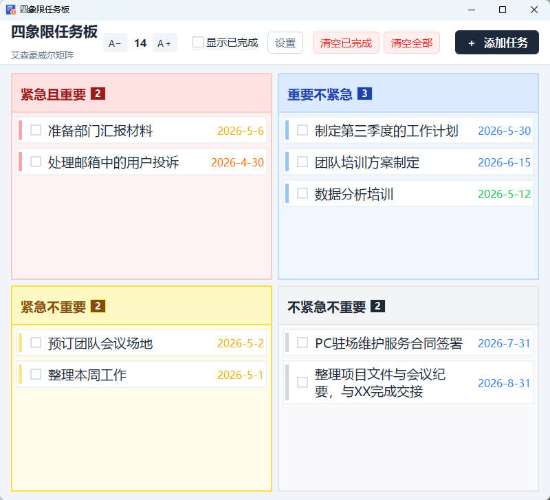

# 四象限任务板 (Quadrant Task Board)

基于 PySide6 的艾森豪威尔矩阵（Eisenhower Matrix）任务管理桌面应用。



## 功能特性

### 四象限管理
- **紧急且重要 (Q1)** - 立即处理，红色系
- **重要不紧急 (Q2)** - 规划执行，蓝色系
- **紧急不重要 (Q3)** - 委托他人，黄色系
- **不紧急不重要 (Q4)** - 考虑删减，灰色系

### 核心功能
- **拖拽移动** - 任务卡片可在象限间自由拖拽
- **双击编辑** - 双击任务卡片直接编辑
- **截止日期** - 支持 YYYY-MM-DD 格式，颜色随临近程度变化
- **完成标记** - 点击复选框标记任务完成，支持显示/隐藏已完成任务
- **字号调节** - 工具栏 A− / A＋ 按钮调节全局字体大小
- **颜色自定义** - 设置界面可自定义各状态截止日期颜色
- **数据持久化** - 自动保存到 `quadrant_data.json`
- **双击添加** - 双击象限空白区域，快速添加任务到该象限
- **撤销/重做** - 支持 7 种操作的撤销与重做：删除任务、标记完成/未完成、编辑任务、清空已完成、清空全部、拖拽移动、添加任务

### 工具栏按钮
| 按钮 | 功能 |
|------|------|
| `＋` | 新建任务 |
| `✓` | 切换显示/隐藏已完成任务 |
| `设置` | 自定义截止日期颜色与阈值 |
| `清空已做` | 清除当前象限已标记任务 |
| `清空全部` | 清除当前象限所有任务（需确认） |
| `↩` | 撤销上一步操作 |
| `A−` / `A＋` | 缩小/放大全局字体 |

## 界面预览

应用采用现代 Fusion 风格，中文雅黑字体，四象限以不同色调区分：
- Q1 红色调、Q2 蓝色调、Q3 黄色调、Q4 灰色调
- 任务卡片左侧带有象限色条标识
- 鼠标悬停显示删除动作条（位于右下角，与截止日期重叠）

### 添加/编辑对话框
- 象限以 2x2 可视化网格展示，带象限色条
- 选中象限高亮显示，操作更直观

## 技术栈

- **Python 3.11+**
- **PySide6** - Qt 图形界面
- **PyInstaller** - 打包为独立 EXE

## 项目结构

```
QuadrantTask/
├── main.py              # 应用入口
├── __init__.py          # 包初始化，版本信息
├── constants.py         # 全局常量：象限定义、颜色、字体
├── data.py              # 数据持久化层（JSON）
├── main_window.py       # 主窗口与工具栏
├── quadrant_panel.py    # 单个象限面板（含拖放逻辑）
├── task_card.py         # 可拖拽任务卡片组件
├── dialogs.py           # 添加/编辑/设置对话框
├── source/              # SVG 图标资源
│   ├── icon.svg         # 窗口图标
│   ├── add.svg          # 添加按钮
│   ├── delete.svg       # 删除按钮
│   ├── delfin.svg       # 清空已完成
│   ├── delall.svg       # 清空全部
│   ├── fin.svg / fin2.svg    # 显示/隐藏已完成
│   └── undo.svg / undo2.svg  # 撤销/重做
├── QuadrantTask.spec    # PyInstaller 打包配置
├── quadrant_data.json   # 任务数据存储
└── Preview.jpg          # 预览图
```

## 运行方式

### 直接运行源码
```bash
pip install PySide6
python main.py
```

### 打包为 EXE
```bash
pip install pyinstaller
pyinstaller QuadrantTask.spec
```
生成的可执行文件位于 `dist/QuadrantTask.exe`。

## 数据存储

运行时数据保存在 `quadrant_data.json`，包含字段：
- `font_size` - 全局字体大小
- `geometry` - 窗口位置与尺寸
- `deadline_colors` - 截止日期颜色配置
- `deadline_thresholds` - 截止日期颜色阈值
- `tasks` - 各象限任务列表

## 版本

v1.2.1

### v1.2.0 更新内容

#### 代码重构
- **类型提示**：全项目添加 Python Type Hinting，提升 IDE 支持
- **命名规范**：遵循 PEP 8，变量/函数名更具语义
- **撤销系统解耦**：QuadrantPanel 通过公开接口（`push_undo`/`find_task`）操作撤销，消除直接访问内部属性
- **信号槽优化**：所有槽函数添加 `@Slot()` 装饰器，提升性能
- **if/elif 修复**：修复 `_update_widget_fonts` 中的逻辑 bug

#### DPI 自适应
- 所有硬编码像素值改为 DPI 自适应
- 新增 `_px()` / `_logical_to_physical()` 方法自动适配高分辨率屏幕
- 支持 4K 显示器等 HiDPI 设备

#### 架构改进
- 引入 `UndoAction` 类封装动作类型常量，消除字符串硬编码
- 使用 `TYPE_CHECKING` 避免循环导入
- 公共方法添加 Docstrings 文档
- 提取公共函数 `_build_title_section()`、`_create_toolbar_icon_btn()` 减少重复代码

### v1.2.1 HiDPI 图标修复

- 改用环境变量 `QT_ENABLE_HIGHDPI_SCALING` 和 `QT_SCALE_FACTOR_ROUNDING_POLICY` 启用 HiDPI 支持，替代已弃用的 `AA_EnableHighDpiScaling` 属性
- 图标始终添加 1x 和 2x 两个分辨率版本，Qt 根据当前 DPI 自动选择最合适的版本
- 修复切换图标时只显示左上四分之一的问题
- 支持所有 DPI 缩放比例：100%、125%、150%、175%、200%、225% 等
